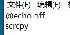

scrcpy的使用方法

0.一个基于scrcpy的在线网站:https://app.tangoapp.dev

1.将文件夹路径添加到系统环境变量的Path中

2.无论有线还是无线链接方法：创建一个.bat文件，然后输入表示自动打开cmd然后键入scrcpy命令并执行。快捷bat文件放在release中

3.指令：

3.1禁用音频：scrcpy --no-audio

3.2无线连接：打开手机端的无线调试功能，先用usb连接，然后在.bat文件键入即可，主要是修改手机IP地址就行；
  
3.3只读：scrcpy --no-control或scrcpy -n

3.4复制粘贴：ctrl+c复制/+x剪切/+v复制。任何Android程序都可以读取该内容

3.5模拟缩放：crtl+鼠标左键

3.6默认鼠标右键返回，中键主页面，禁用两项功能可选scrcpy --forward-all-clicks

3.7安装apk：直接拖入窗口就行

3.8传输文件默认放在/download文件夹内，修改文件保存位置可以使用命令：scrcpy --push-target=/sdcard/Movies/

3.9防止休眠：scrcpy -w，无线连接无效

3.10连接后关闭屏幕：-S 或--turn-screen-off , 目前Android14用不了

3.11打开虚拟键盘，方便打字：Android14不起作用。有一种可能可行的解决方法：每次连接时复制粘贴一段文本到手机上，可以尝试打开虚拟键盘。

--keyboard=sdk 

--keyboard=uhid 

--keyboard=aoa  

3.12镜像时录制音频和视频：

scrcpy --record=file.mp4

scrcpy -r file.mkv

3.12.1只录制视频：scrcpy --no-audio --record=file.mp4

3.12.2只录制音频：

scrcpy --no-video --record=file.opus

scrcpy --no-video --audio-codec=aac --record=file.aac

scrcpy --no-video --audio-codec=flac --record=file.flac

scrcpy --no-video --audio-codec=raw --record=file.wav

3.13快捷键：需要加上控制键，默认是左Alt或左Super

切换全屏：f

屏幕左/右转：←/→

窗口调整为1:1：g ，不要随意使用

解锁屏幕：m

调节音量：↑/↓

关闭屏幕但保持镜像：o，Android14不起作用

打开：shift+o ， Android14无效

修改快捷键：scrcpy --shortcut-mod=rctrl

模拟电源键：p ， 按一下代表锁屏

3.14调节分辨率：默认是手机分辨率

scrcpy -m 1024/1920

3.15视频比特率：默认8M

scrcpy -b 2M

3.16帧率：

scrcpy --max-fps=15

3.17选择视频解码器：默认h264，延迟低，h265质量好但延迟高，av1不常见

scrcpy --video-codec=h265或av1

3.18指定镜像窗口出现的位置和大小:

scrcpy --window-x=0 --window-y=100 --window-width=400 --window-height=900

这个位置和尺寸比较好

--window-x=-1050 --window-y=700 --window-width=400 --window-height=900

这个位置出现在左侧竖屏的左下角

--window-x=-1050 --window-y=0 --window-width=400 --window-height=900

这个则是左上角

3.19让镜像窗口永远在顶部：

scrcpy --window-borderless

